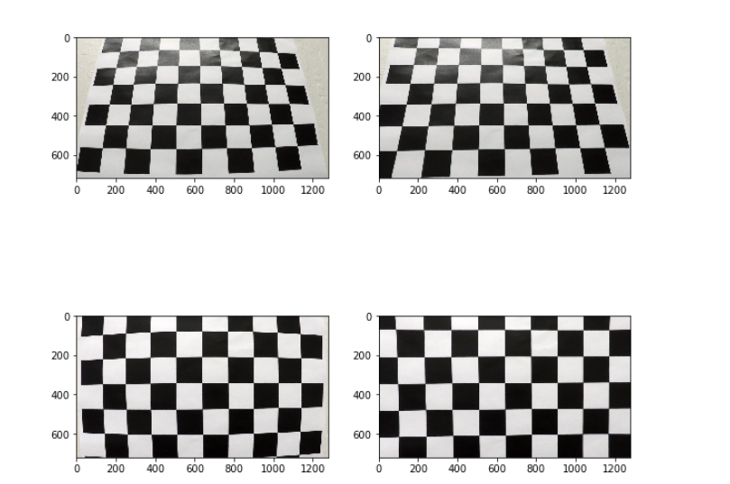
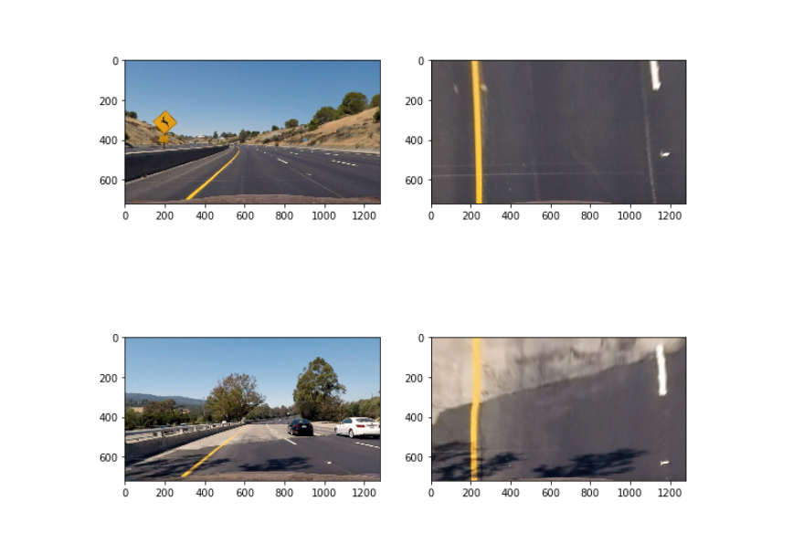
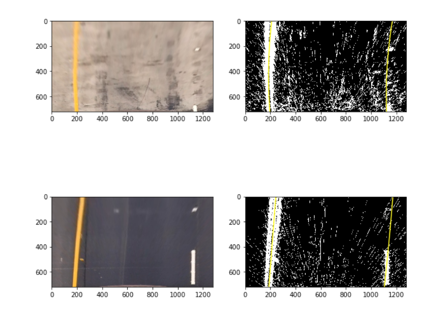
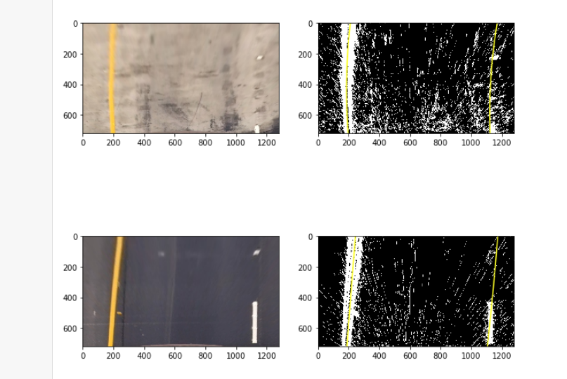

### Project suggestion:
* Compute the camera calibration matrix and distortion coefficients given a set of chessboard images.
Apply a distortion correction to raw images.
* Apply a perspective transform to rectify binary image ("birds-eye view").
* Use color transforms, gradients, etc., to create a thresholded binary image.
* Detect lane pixels and fit to find the lane boundary.
* Determine the curvature of the lane and vehicle position with respect to center.
* Warp the detected lane boundaries back onto the original image.
* Output visual display of the lane boundaries and numerical estimation of lane curvature and vehicle
position.

### Camera calibration
I calibrate  camera in two steps.

1. Find distortion coefficients.
Image for calibration stored in [camera_cal](camera_cal) directory. Distortion examples:

2. Find target zone. Test image stored in [test_images](test_images). Bird's eye result:

Both steps are present in [notebook](Calibrate camera.ipynb)

### Filter image
For filter pixels witch can be on the lane I use several Sobol transforms based on saturation.
All methods were tested on [notebook](Filter lanes.ipynb)

### Combine pipeline

To make sure that everything works fine I tested all methods on images from `test_images` directory. 

More examples on [notebook](Process images.ipynb)

### FInd lanes on videos
Applying this methods to video yields polynomials for which image. 
But some of them do not close to lanes boundaries. 
For better result I used average of that polynomials as prior polynom.
See [notebook](Process video.ipynb).

Result [video](output_videos/project_video.mp4).

### Suggest improvements
1. Calculate prior polynom dynamic based on polynomials from previous frames.
2. Curvature and offset calculated on bird's eye projection. The scale of axes is necessary to calculate correct values.  
3. It is possible find better filter method.